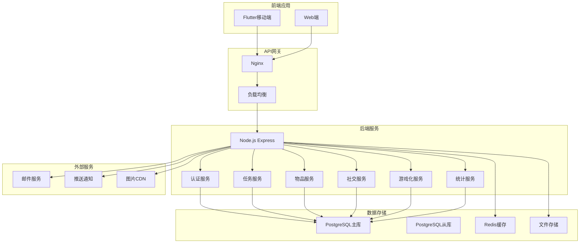
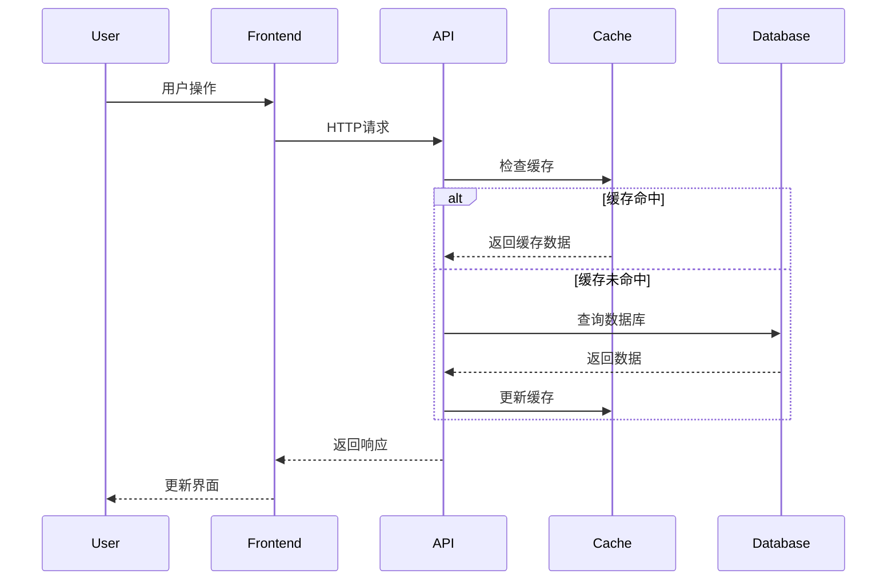
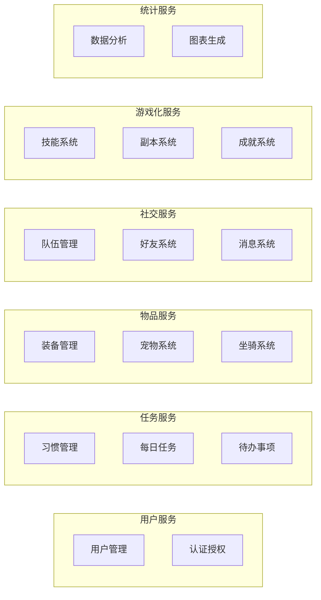

# Habitica风格应用系统架构设计

## 1. 数据模型设计

### 1.1 扩展用户系统

#### 用户基础信息表 (users)
```sql
CREATE TABLE users (
    id SERIAL PRIMARY KEY,
    username VARCHAR(50) UNIQUE NOT NULL,
    email VARCHAR(100) UNIQUE NOT NULL,
    password_hash VARCHAR(255) NOT NULL,
    avatar_url VARCHAR(255),

    -- 游戏化属性
    level INTEGER DEFAULT 1,
    experience INTEGER DEFAULT 0,
    experience_to_next INTEGER DEFAULT 100,
    health INTEGER DEFAULT 50,
    max_health INTEGER DEFAULT 50,
    mana INTEGER DEFAULT 10,
    max_mana INTEGER DEFAULT 10,
    coins INTEGER DEFAULT 0,
    gold INTEGER DEFAULT 0,

    -- 职业系统
    class VARCHAR(20) DEFAULT 'warrior', -- warrior, mage, rogue, healer
    class_points INTEGER DEFAULT 0,

    -- 属性点
    strength INTEGER DEFAULT 10,
    intelligence INTEGER DEFAULT 10,
    constitution INTEGER DEFAULT 10,
    perception INTEGER DEFAULT 10,

    -- 统计信息
    total_tasks_completed INTEGER DEFAULT 0,
    streak_highest INTEGER DEFAULT 0,
    login_streak INTEGER DEFAULT 0,
    last_login TIMESTAMP,

    -- 偏好设置
    preferences JSONB DEFAULT '{}',
    flags JSONB DEFAULT '{}',

    -- 时间戳
    created_at TIMESTAMP DEFAULT CURRENT_TIMESTAMP,
    updated_at TIMESTAMP DEFAULT CURRENT_TIMESTAMP,
    deleted_at TIMESTAMP
);
```

#### 用户属性配置表 (user_attributes)
```sql
CREATE TABLE user_attributes (
    id SERIAL PRIMARY KEY,
    user_id INTEGER REFERENCES users(id) ON DELETE CASCADE,

    -- 自动分配属性点
    auto_allocate BOOLEAN DEFAULT false,
    allocation_mode VARCHAR(20) DEFAULT 'balanced', -- balanced, class, manual

    -- 属性分配历史
    strength_allocated INTEGER DEFAULT 0,
    intelligence_allocated INTEGER DEFAULT 0,
    constitution_allocated INTEGER DEFAULT 0,
    perception_allocated INTEGER DEFAULT 0,

    created_at TIMESTAMP DEFAULT CURRENT_TIMESTAMP,
    updated_at TIMESTAMP DEFAULT CURRENT_TIMESTAMP
);
```

### 1.2 任务系统

#### 习惯表 (habits)
```sql
CREATE TABLE habits (
    id SERIAL PRIMARY KEY,
    user_id INTEGER REFERENCES users(id) ON DELETE CASCADE,

    title VARCHAR(255) NOT NULL,
    notes TEXT,
    type VARCHAR(10) NOT NULL, -- good, bad

    -- 难度和奖励
    difficulty VARCHAR(10) DEFAULT 'easy', -- trivial, easy, medium, hard
    up_count INTEGER DEFAULT 0,
    down_count INTEGER DEFAULT 0,

    -- 计数器
    counter_up INTEGER DEFAULT 0,
    counter_down INTEGER DEFAULT 0,

    -- 排序和显示
    position INTEGER DEFAULT 0,
    is_positive BOOLEAN DEFAULT true,
    is_negative BOOLEAN DEFAULT true,

    -- 状态
    is_archived BOOLEAN DEFAULT false,

    created_at TIMESTAMP DEFAULT CURRENT_TIMESTAMP,
    updated_at TIMESTAMP DEFAULT CURRENT_TIMESTAMP
);
```

#### 每日任务表 (dailies)
```sql
CREATE TABLE dailies (
    id SERIAL PRIMARY KEY,
    user_id INTEGER REFERENCES users(id) ON DELETE CASCADE,

    title VARCHAR(255) NOT NULL,
    notes TEXT,

    -- 难度和奖励
    difficulty VARCHAR(10) DEFAULT 'easy',

    -- 重复规则
    repeat_type VARCHAR(10) DEFAULT 'weekly', -- daily, weekly, monthly
    repeat_days JSONB DEFAULT '[]', -- [1,2,3,4,5,6,7] for weekly
    start_date DATE,
    every_x INTEGER DEFAULT 1,

    -- 状态跟踪
    streak INTEGER DEFAULT 0,
    longest_streak INTEGER DEFAULT 0,
    is_completed BOOLEAN DEFAULT false,
    last_completed_date DATE,

    -- 提醒设置
    reminder_time TIME,

    -- 排序
    position INTEGER DEFAULT 0,

    -- 状态
    is_archived BOOLEAN DEFAULT false,

    created_at TIMESTAMP DEFAULT CURRENT_TIMESTAMP,
    updated_at TIMESTAMP DEFAULT CURRENT_TIMESTAMP
);
```

#### 待办事项表 (todos)
```sql
CREATE TABLE todos (
    id SERIAL PRIMARY KEY,
    user_id INTEGER REFERENCES users(id) ON DELETE CASCADE,

    title VARCHAR(255) NOT NULL,
    notes TEXT,

    -- 难度和奖励
    difficulty VARCHAR(10) DEFAULT 'easy',

    -- 日期相关
    due_date DATE,
    date_completed TIMESTAMP,

    -- 检查清单
    checklist JSONB DEFAULT '[]', -- [{text: "item1", completed: false}]

    -- 状态
    is_completed BOOLEAN DEFAULT false,

    -- 排序
    position INTEGER DEFAULT 0,

    created_at TIMESTAMP DEFAULT CURRENT_TIMESTAMP,
    updated_at TIMESTAMP DEFAULT CURRENT_TIMESTAMP
);
```

#### 任务历史表 (task_history)
```sql
CREATE TABLE task_history (
    id SERIAL PRIMARY KEY,
    user_id INTEGER REFERENCES users(id) ON DELETE CASCADE,
    task_type VARCHAR(10) NOT NULL, -- habit, daily, todo
    task_id INTEGER NOT NULL,

    action VARCHAR(20) NOT NULL, -- completed, uncompleted, scored_up, scored_down
    experience_gained INTEGER DEFAULT 0,
    gold_gained INTEGER DEFAULT 0,
    mana_gained INTEGER DEFAULT 0,

    created_at TIMESTAMP DEFAULT CURRENT_TIMESTAMP
);
```

### 1.3 物品系统

#### 装备表 (equipment)
```sql
CREATE TABLE equipment (
    id SERIAL PRIMARY KEY,
    key VARCHAR(50) UNIQUE NOT NULL,
    name VARCHAR(100) NOT NULL,
    type VARCHAR(20) NOT NULL, -- weapon, armor, head, shield, body, back, head_accessory, eyewear
    class VARCHAR(20), -- warrior, mage, rogue, healer, special

    -- 属性加成
    strength_bonus INTEGER DEFAULT 0,
    intelligence_bonus INTEGER DEFAULT 0,
    constitution_bonus INTEGER DEFAULT 0,
    perception_bonus INTEGER DEFAULT 0,

    -- 价格
    gold_cost INTEGER DEFAULT 0,
    gem_cost INTEGER DEFAULT 0,

    -- 外观
    image_url VARCHAR(255),

    -- 限制
    level_required INTEGER DEFAULT 1,
    special_class VARCHAR(20),

    created_at TIMESTAMP DEFAULT CURRENT_TIMESTAMP
);
```

#### 用户装备表 (user_equipment)
```sql
CREATE TABLE user_equipment (
    id SERIAL PRIMARY KEY,
    user_id INTEGER REFERENCES users(id) ON DELETE CASCADE,
    equipment_id INTEGER REFERENCES equipment(id) ON DELETE CASCADE,

    is_owned BOOLEAN DEFAULT false,
    is_equipped BOOLEAN DEFAULT false,

    created_at TIMESTAMP DEFAULT CURRENT_TIMESTAMP,
    updated_at TIMESTAMP DEFAULT CURRENT_TIMESTAMP,

    UNIQUE(user_id, equipment_id)
);
```

#### 宠物表 (pets)
```sql
CREATE TABLE pets (
    id SERIAL PRIMARY KEY,
    key VARCHAR(50) UNIQUE NOT NULL,
    name VARCHAR(100) NOT NULL,
    type VARCHAR(20) NOT NULL, -- standard, premium, special
    egg_type VARCHAR(50),
    potion_type VARCHAR(50),

    -- 外观
    image_url VARCHAR(255),

    -- 稀有度
    rarity VARCHAR(10) DEFAULT 'common', -- common, rare, epic, legendary

    created_at TIMESTAMP DEFAULT CURRENT_TIMESTAMP
);
```

#### 用户宠物表 (user_pets)
```sql
CREATE TABLE user_pets (
    id SERIAL PRIMARY KEY,
    user_id INTEGER REFERENCES users(id) ON DELETE CASCADE,
    pet_id INTEGER REFERENCES pets(id) ON DELETE CASCADE,

    is_owned BOOLEAN DEFAULT false,
    is_active BOOLEAN DEFAULT false,
    level INTEGER DEFAULT 1,

    created_at TIMESTAMP DEFAULT CURRENT_TIMESTAMP,
    updated_at TIMESTAMP DEFAULT CURRENT_TIMESTAMP,

    UNIQUE(user_id, pet_id)
);
```

#### 坐骑表 (mounts)
```sql
CREATE TABLE mounts (
    id SERIAL PRIMARY KEY,
    key VARCHAR(50) UNIQUE NOT NULL,
    name VARCHAR(100) NOT NULL,
    type VARCHAR(20) NOT NULL,

    -- 外观
    image_url VARCHAR(255),

    -- 稀有度
    rarity VARCHAR(10) DEFAULT 'common',

    created_at TIMESTAMP DEFAULT CURRENT_TIMESTAMP
);
```

#### 用户坐骑表 (user_mounts)
```sql
CREATE TABLE user_mounts (
    id SERIAL PRIMARY KEY,
    user_id INTEGER REFERENCES users(id) ON DELETE CASCADE,
    mount_id INTEGER REFERENCES mounts(id) ON DELETE CASCADE,

    is_owned BOOLEAN DEFAULT false,
    is_active BOOLEAN DEFAULT false,

    created_at TIMESTAMP DEFAULT CURRENT_TIMESTAMP,
    updated_at TIMESTAMP DEFAULT CURRENT_TIMESTAMP,

    UNIQUE(user_id, mount_id)
);
```

#### 消耗品表 (consumables)
```sql
CREATE TABLE consumables (
    id SERIAL PRIMARY KEY,
    key VARCHAR(50) UNIQUE NOT NULL,
    name VARCHAR(100) NOT NULL,
    type VARCHAR(20) NOT NULL, -- health_potion, mana_potion, special

    -- 效果
    effect_type VARCHAR(20),
    effect_value INTEGER,

    -- 价格
    gold_cost INTEGER DEFAULT 0,
    gem_cost INTEGER DEFAULT 0,

    created_at TIMESTAMP DEFAULT CURRENT_TIMESTAMP
);
```

#### 用户物品表 (user_items)
```sql
CREATE TABLE user_items (
    id SERIAL PRIMARY KEY,
    user_id INTEGER REFERENCES users(id) ON DELETE CASCADE,
    consumable_id INTEGER REFERENCES consumables(id) ON DELETE CASCADE,

    quantity INTEGER DEFAULT 0,

    created_at TIMESTAMP DEFAULT CURRENT_TIMESTAMP,
    updated_at TIMESTAMP DEFAULT CURRENT_TIMESTAMP,

    UNIQUE(user_id, consumable_id)
);
```

### 1.4 社交系统

#### 队伍表 (parties)
```sql
CREATE TABLE parties (
    id SERIAL PRIMARY KEY,
    name VARCHAR(100) NOT NULL,
    description TEXT,

    -- 队长
    leader_id INTEGER REFERENCES users(id),

    -- 隐私设置
    privacy VARCHAR(10) DEFAULT 'private', -- private, public

    -- 队伍信息
    max_members INTEGER DEFAULT 30,

    -- 自定义
    image_url VARCHAR(255),

    created_at TIMESTAMP DEFAULT CURRENT_TIMESTAMP,
    updated_at TIMESTAMP DEFAULT CURRENT_TIMESTAMP
);
```

#### 队伍成员表 (party_members)
```sql
CREATE TABLE party_members (
    id SERIAL PRIMARY KEY,
    party_id INTEGER REFERENCES parties(id) ON DELETE CASCADE,
    user_id INTEGER REFERENCES users(id) ON DELETE CASCADE,

    role VARCHAR(20) DEFAULT 'member', -- leader, moderator, member

    joined_at TIMESTAMP DEFAULT CURRENT_TIMESTAMP,

    UNIQUE(party_id, user_id)
);
```

#### 好友系统表 (friends)
```sql
CREATE TABLE friends (
    id SERIAL PRIMARY KEY,
    requester_id INTEGER REFERENCES users(id) ON DELETE CASCADE,
    addressee_id INTEGER REFERENCES users(id) ON DELETE CASCADE,

    status VARCHAR(10) DEFAULT 'pending', -- pending, accepted, blocked

    created_at TIMESTAMP DEFAULT CURRENT_TIMESTAMP,
    updated_at TIMESTAMP DEFAULT CURRENT_TIMESTAMP,

    UNIQUE(requester_id, addressee_id)
);
```

#### 消息表 (messages)
```sql
CREATE TABLE messages (
    id SERIAL PRIMARY KEY,
    sender_id INTEGER REFERENCES users(id) ON DELETE CASCADE,
    recipient_id INTEGER REFERENCES users(id) ON DELETE CASCADE,

    content TEXT NOT NULL,
    is_read BOOLEAN DEFAULT false,

    created_at TIMESTAMP DEFAULT CURRENT_TIMESTAMP
);
```

#### 挑战表 (challenges)
```sql
CREATE TABLE challenges (
    id SERIAL PRIMARY KEY,
    creator_id INTEGER REFERENCES users(id),
    group_id INTEGER REFERENCES parties(id),

    name VARCHAR(100) NOT NULL,
    description TEXT,

    -- 挑战类型
    type VARCHAR(20) DEFAULT 'habit', -- habit, daily, todo

    -- 奖励
    prize_gold INTEGER DEFAULT 0,
    prize_gems INTEGER DEFAULT 0,

    -- 时间限制
    start_date DATE,
    end_date DATE,

    -- 状态
    is_active BOOLEAN DEFAULT true,

    created_at TIMESTAMP DEFAULT CURRENT_TIMESTAMP,
    updated_at TIMESTAMP DEFAULT CURRENT_TIMESTAMP
);
```

#### 挑战参与者表 (challenge_participants)
```sql
CREATE TABLE challenge_participants (
    id SERIAL PRIMARY KEY,
    challenge_id INTEGER REFERENCES challenges(id) ON DELETE CASCADE,
    user_id INTEGER REFERENCES users(id) ON DELETE CASCADE,

    -- 进度
    progress INTEGER DEFAULT 0,
    score INTEGER DEFAULT 0,

    -- 状态
    is_winner BOOLEAN DEFAULT false,

    joined_at TIMESTAMP DEFAULT CURRENT_TIMESTAMP,

    UNIQUE(challenge_id, user_id)
);
```

### 1.5 游戏化系统

#### 技能表 (skills)
```sql
CREATE TABLE skills (
    id SERIAL PRIMARY KEY,
    key VARCHAR(50) UNIQUE NOT NULL,
    name VARCHAR(100) NOT NULL,
    class VARCHAR(20) NOT NULL, -- warrior, mage, rogue, healer

    -- 技能属性
    mana_cost INTEGER DEFAULT 0,
    target VARCHAR(20) DEFAULT 'self', -- self, party, task

    -- 效果
    effect_type VARCHAR(20),
    effect_value INTEGER,

    -- 限制
    level_required INTEGER DEFAULT 1,

    created_at TIMESTAMP DEFAULT CURRENT_TIMESTAMP
);
```

#### 用户技能表 (user_skills)
```sql
CREATE TABLE user_skills (
    id SERIAL PRIMARY KEY,
    user_id INTEGER REFERENCES users(id) ON DELETE CASCADE,
    skill_id INTEGER REFERENCES skills(id) ON DELETE CASCADE,

    is_unlocked BOOLEAN DEFAULT false,
    last_used TIMESTAMP,

    created_at TIMESTAMP DEFAULT CURRENT_TIMESTAMP,

    UNIQUE(user_id, skill_id)
);
```

#### Buff/Debuff表 (buffs)
```sql
CREATE TABLE buffs (
    id SERIAL PRIMARY KEY,
    user_id INTEGER REFERENCES users(id) ON DELETE CASCADE,

    type VARCHAR(20) NOT NULL, -- strength, intelligence, etc.
    value INTEGER NOT NULL,

    -- 持续时间
    duration_hours INTEGER DEFAULT 24,
    expires_at TIMESTAMP,

    source VARCHAR(20), -- skill, item, quest

    created_at TIMESTAMP DEFAULT CURRENT_TIMESTAMP
);
```

#### 副本表 (quests)
```sql
CREATE TABLE quests (
    id SERIAL PRIMARY KEY,
    key VARCHAR(50) UNIQUE NOT NULL,
    name VARCHAR(100) NOT NULL,
    description TEXT,

    -- 难度
    difficulty VARCHAR(10) DEFAULT 'easy', -- easy, medium, hard, boss

    -- 要求
    level_required INTEGER DEFAULT 1,

    -- 奖励
    experience_reward INTEGER DEFAULT 0,
    gold_reward INTEGER DEFAULT 0,
    item_rewards JSONB DEFAULT '[]',

    -- 进度
    max_progress INTEGER DEFAULT 100,

    created_at TIMESTAMP DEFAULT CURRENT_TIMESTAMP
);
```

#### 用户副本进度表 (user_quests)
```sql
CREATE TABLE user_quests (
    id SERIAL PRIMARY KEY,
    user_id INTEGER REFERENCES users(id) ON DELETE CASCADE,
    quest_id INTEGER REFERENCES quests(id) ON DELETE CASCADE,

    -- 进度
    progress INTEGER DEFAULT 0,

    -- 状态
    status VARCHAR(10) DEFAULT 'locked', -- locked, active, completed

    -- 完成时间
    completed_at TIMESTAMP,

    created_at TIMESTAMP DEFAULT CURRENT_TIMESTAMP,
    updated_at TIMESTAMP DEFAULT CURRENT_TIMESTAMP,

    UNIQUE(user_id, quest_id)
);
```

#### 成就表 (achievements)
```sql
CREATE TABLE achievements (
    id SERIAL PRIMARY KEY,
    key VARCHAR(50) UNIQUE NOT NULL,
    name VARCHAR(100) NOT NULL,
    description TEXT,

    -- 类型
    category VARCHAR(20) NOT NULL, -- basic, seasonal, special

    -- 奖励
    experience_reward INTEGER DEFAULT 0,
    gold_reward INTEGER DEFAULT 0,

    created_at TIMESTAMP DEFAULT CURRENT_TIMESTAMP
);
```

#### 用户成就表 (user_achievements)
```sql
CREATE TABLE user_achievements (
    id SERIAL PRIMARY KEY,
    user_id INTEGER REFERENCES users(id) ON DELETE CASCADE,
    achievement_id INTEGER REFERENCES achievements(id) ON DELETE CASCADE,

    -- 进度
    progress INTEGER DEFAULT 0,
    max_progress INTEGER DEFAULT 1,

    -- 状态
    is_achieved BOOLEAN DEFAULT false,

    -- 解锁时间
    achieved_at TIMESTAMP,

    created_at TIMESTAMP DEFAULT CURRENT_TIMESTAMP,

    UNIQUE(user_id, achievement_id)
);
```

### 1.6 统计系统

#### 用户统计表 (user_stats)
```sql
CREATE TABLE user_stats (
    id SERIAL PRIMARY KEY,
    user_id INTEGER REFERENCES users(id) ON DELETE CASCADE,

    -- 任务统计
    habits_completed INTEGER DEFAULT 0,
    dailies_completed INTEGER DEFAULT 0,
    todos_completed INTEGER DEFAULT 0,

    -- 完美日统计
    perfect_days INTEGER DEFAULT 0,
    current_perfect_day_streak INTEGER DEFAULT 0,
    longest_perfect_day_streak INTEGER DEFAULT 0,

    -- 伤害统计
    total_damage_dealt INTEGER DEFAULT 0,
    total_damage_received INTEGER DEFAULT 0,

    -- 物品统计
    total_pets_found INTEGER DEFAULT 0,
    total_mounts_tamed INTEGER DEFAULT 0,
    total_equipment_owned INTEGER DEFAULT 0,

    -- 社交统计
    total_messages_sent INTEGER DEFAULT 0,
    total_parties_joined INTEGER DEFAULT 0,
    total_challenges_won INTEGER DEFAULT 0,

    -- 时间统计
    total_playtime_minutes INTEGER DEFAULT 0,
    last_activity_at TIMESTAMP,

    created_at TIMESTAMP DEFAULT CURRENT_TIMESTAMP,
    updated_at TIMESTAMP DEFAULT CURRENT_TIMESTAMP
);
```

#### 每日统计表 (daily_stats)
```sql
CREATE TABLE daily_stats (
    id SERIAL PRIMARY KEY,
    user_id INTEGER REFERENCES users(id) ON DELETE CASCADE,
    date DATE NOT NULL,

    -- 任务完成数
    habits_completed INTEGER DEFAULT 0,
    dailies_completed INTEGER DEFAULT 0,
    todos_completed INTEGER DEFAULT 0,

    -- 获得奖励
    experience_gained INTEGER DEFAULT 0,
    gold_gained INTEGER DEFAULT 0,
    mana_gained INTEGER DEFAULT 0,

    -- 其他统计
    damage_dealt INTEGER DEFAULT 0,
    damage_received INTEGER DEFAULT 0,

    created_at TIMESTAMP DEFAULT CURRENT_TIMESTAMP,

    UNIQUE(user_id, date)
);
```

## 2. API架构设计

### 2.1 用户管理 (8个端点)

#### 认证相关
- `POST /api/auth/register` - 用户注册
- `POST /api/auth/login` - 用户登录
- `POST /api/auth/logout` - 用户登出
- `POST /api/auth/refresh` - 刷新令牌

#### 用户资料
- `GET /api/users/profile` - 获取用户资料
- `PUT /api/users/profile` - 更新用户资料
- `DELETE /api/users/account` - 删除账户
- `POST /api/users/preferences` - 更新用户偏好

### 2.2 任务管理 (15个端点)

#### 习惯管理
- `GET /api/habits` - 获取所有习惯
- `POST /api/habits` - 创建新习惯
- `GET /api/habits/:id` - 获取单个习惯
- `PUT /api/habits/:id` - 更新习惯
- `DELETE /api/habits/:id` - 删除习惯
- `POST /api/habits/:id/score` - 评分习惯

#### 每日任务
- `GET /api/dailies` - 获取所有每日任务
- `POST /api/dailies` - 创建每日任务
- `GET /api/dailies/:id` - 获取单个每日任务
- `PUT /api/dailies/:id` - 更新每日任务
- `DELETE /api/dailies/:id` - 删除每日任务
- `POST /api/dailies/:id/complete` - 完成每日任务

#### 待办事项
- `GET /api/todos` - 获取所有待办事项
- `POST /api/todos` - 创建待办事项
- `GET /api/todos/:id` - 获取单个待办事项
- `PUT /api/todos/:id` - 更新待办事项
- `DELETE /api/todos/:id` - 删除待办事项
- `POST /api/todos/:id/complete` - 完成待办事项

### 2.3 物品系统 (12个端点)

#### 装备管理
- `GET /api/equipment` - 获取所有装备
- `GET /api/equipment/owned` - 获取已拥有装备
- `POST /api/equipment/:id/buy` - 购买装备
- `POST /api/equipment/:id/equip` - 装备物品
- `POST /api/equipment/:id/unequip` - 卸下物品

#### 宠物系统
- `GET /api/pets` - 获取所有宠物
- `GET /api/pets/owned` - 获取已拥有宠物
- `POST /api/pets/:id/hatch` - 孵化宠物
- `POST /api/pets/:id/feed` - 喂养宠物
- `POST /api/pets/:id/equip` - 装备宠物

#### 坐骑系统
- `GET /api/mounts` - 获取所有坐骑
- `GET /api/mounts/owned` - 获取已拥有坐骑
- `POST /api/mounts/:id/tame` - 驯服坐骑
- `POST /api/mounts/:id/equip` - 装备坐骑

#### 物品管理
- `GET /api/items` - 获取用户物品
- `POST /api/items/:id/use` - 使用物品
- `POST /api/items/:id/buy` - 购买物品

### 2.4 社交功能 (10个端点)

#### 队伍管理
- `GET /api/parties` - 获取用户队伍
- `POST /api/parties` - 创建队伍
- `GET /api/parties/:id` - 获取队伍详情
- `PUT /api/parties/:id` - 更新队伍
- `POST /api/parties/:id/join` - 加入队伍
- `POST /api/parties/:id/leave` - 离开队伍

#### 好友系统
- `GET /api/friends` - 获取好友列表
- `POST /api/friends/:id/request` - 发送好友请求
- `POST /api/friends/:id/accept` - 接受好友请求
- `DELETE /api/friends/:id` - 删除好友

#### 消息系统
- `GET /api/messages` - 获取消息
- `POST /api/messages` - 发送消息
- `PUT /api/messages/:id/read` - 标记已读

#### 挑战系统
- `GET /api/challenges` - 获取挑战
- `POST /api/challenges` - 创建挑战
- `POST /api/challenges/:id/join` - 加入挑战

### 2.5 游戏化功能 (8个端点)

#### 技能系统
- `GET /api/skills` - 获取用户技能
- `POST /api/skills/:id/cast` - 施放技能
- `GET /api/buffs` - 获取当前buff

#### 副本系统
- `GET /api/quests` - 获取可用副本
- `POST /api/quests/:id/start` - 开始副本
- `GET /api/quests/progress` - 获取副本进度

#### 成就系统
- `GET /api/achievements` - 获取成就列表
- `GET /api/achievements/unlocked` - 获取已解锁成就

### 2.6 统计和分析 (5个端点)

#### 用户统计
- `GET /api/stats/overview` - 获取统计概览
- `GET /api/stats/detailed` - 获取详细统计
- `GET /api/stats/daily` - 获取每日统计
- `GET /api/stats/weekly` - 获取每周统计
- `GET /api/stats/monthly` - 获取每月统计

## 3. 系统架构图

### 3.1 整体架构


### 3.2 数据流架构


### 3.3 微服务架构


## 4. 核心功能描述

### 4.1 用户系统
- **等级系统**: 用户通过完成任务获得经验值，达到阈值后升级
- **属性系统**: 力量、智力、体质、感知四维属性影响任务奖励
- **职业系统**: 四种职业（战士、法师、盗贼、医者）各有特色技能
- **货币系统**: 金币用于购买物品，宝石用于特殊物品

### 4.2 任务系统
- **习惯系统**: 可设置好习惯和坏习惯，支持双向评分
- **每日任务**: 支持复杂重复规则，包含连续完成奖励
- **待办事项**: 支持检查清单和截止日期
- **任务历史**: 记录所有任务操作历史

### 4.3 物品系统
- **装备系统**: 不同部位装备提供属性加成
- **宠物系统**: 收集、孵化、升级宠物
- **坐骑系统**: 驯服和装备坐骑
- **消耗品**: 药水、特殊物品等

### 4.4 社交系统
- **队伍系统**: 创建/加入队伍，共同完成任务
- **好友系统**: 添加好友，查看进度
- **消息系统**: 实时消息通信
- **挑战系统**: 创建和参与挑战

### 4.5 游戏化系统
- **技能系统**: 职业特色技能，消耗魔法值
- **副本系统**: 团队副本挑战
- **成就系统**: 多样化成就解锁
- **Buff系统**: 临时属性加成

### 4.6 统计系统
- **实时统计**: 任务完成率、连续天数等
- **历史数据**: 每日/周/月统计
- **可视化图表**: 进度图表展示
- **导出功能**: 数据导出和分享

## 5. 技术栈选择

### 5.1 后端技术栈
- **框架**: Node.js + Express.js
- **数据库**: PostgreSQL + Redis
- **认证**: JWT + bcrypt
- **缓存**: Redis
- **文件存储**: AWS S3 / 阿里云OSS
- **消息队列**: Redis / RabbitMQ

### 5.2 前端技术栈
- **移动端**: Flutter (iOS/Android)
- **Web端**: React.js / Vue.js
- **状态管理**: Redux / Vuex
- **图表库**: Chart.js / D3.js

### 5.3 部署架构
- **容器化**: Docker + Kubernetes
- **CI/CD**: GitHub Actions / Jenkins
- **监控**: Prometheus + Grafana
- **日志**: ELK Stack

## 6. 性能优化策略

### 6.1 数据库优化
- **索引优化**: 为查询频繁的字段建立索引
- **读写分离**: 主从数据库架构
- **分库分表**: 按用户ID分片
- **缓存策略**: Redis缓存热点数据

### 6.2 API优化
- **分页加载**: 大数据集分页
- **数据压缩**: Gzip压缩响应
- **缓存策略**: HTTP缓存头
- **CDN加速**: 静态资源CDN

### 6.3 前端优化
- **懒加载**: 图片和组件懒加载
- **离线缓存**: Service Worker
- **数据预加载**: 智能预加载
- **压缩优化**: 代码压缩和混淆

## 7. 安全考虑

### 7.1 认证安全
- **JWT令牌**: 短期有效的访问令牌
- **刷新令牌**: 长期有效的刷新机制
- **密码安全**: bcrypt加密存储
- **双因子认证**: 可选的2FA支持

### 7.2 数据安全
- **数据加密**: 敏感数据加密存储
- **传输加密**: HTTPS强制使用
- **输入验证**: 严格的输入验证
- **SQL注入防护**: 参数化查询

### 7.3 权限控制
- **角色权限**: 基于角色的访问控制
- **资源权限**: 细粒度的资源权限
- **API限流**: 防止滥用
- **CORS配置**: 跨域安全

## 8. 扩展性设计

### 8.1 水平扩展
- **无状态服务**: 服务无状态设计
- **负载均衡**: 多实例负载均衡
- **数据库分片**: 水平分片支持
- **微服务架构**: 服务解耦

### 8.2 功能扩展
- **插件系统**: 支持第三方插件
- **API版本**: 版本化API设计
- **配置中心**: 动态配置管理
- **A/B测试**: 功能灰度发布

## 9. 监控和运维

### 9.1 应用监控
- **性能监控**: 响应时间、吞吐量
- **错误监控**: 异常捕获和报警
- **业务监控**: 关键业务指标
- **用户行为**: 用户行为分析

### 9.2 系统监控
- **资源监控**: CPU、内存、磁盘
- **网络监控**: 网络延迟、带宽
- **数据库监控**: 查询性能、连接数
- **日志监控**: 日志聚合和分析

## 10. 开发规范

### 10.1 代码规范
- **代码风格**: ESLint + Prettier
- **命名规范**: 统一的命名约定
- **文档规范**: API文档自动生成
- **测试规范**: 单元测试覆盖率

### 10.2 部署规范
- **环境管理**: 开发/测试/生产环境
- **版本管理**: 语义化版本号
- **回滚策略**: 快速回滚机制
- **配置管理**: 环境变量管理
